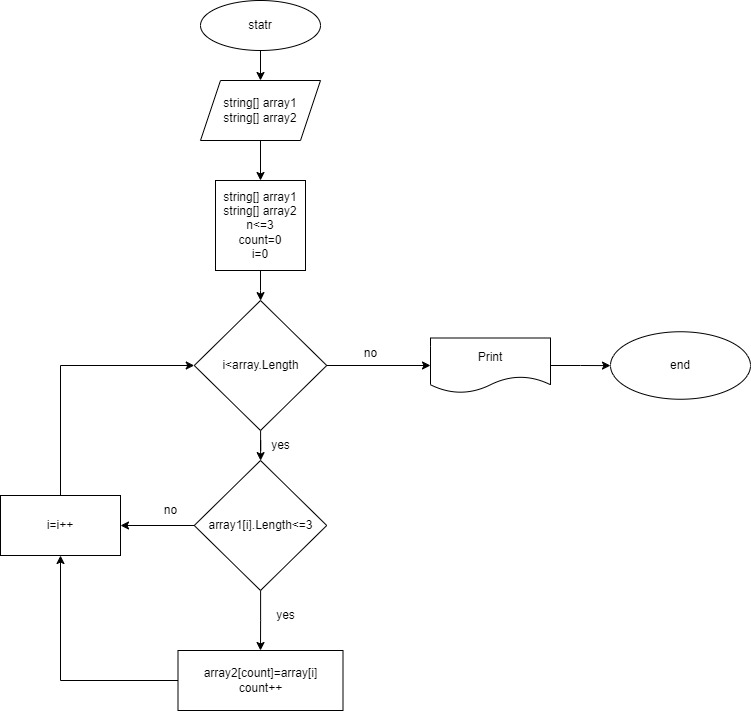

# Задача:
Написать программу, которая из имеющегося массива строк формирует новый массив из строк, длина которых меньше, либо равна 3 символам. Первоначальный массив можно ввести с клавиатуры, либо задать на старте выполнения алгоритма. При решении не рекомендуется пользоваться коллекциями, лучше обойтись исключительно массивами.
## Примеры:
[“Hello”, “2”, “world”, “:-)”] → [“2”, “:-)”];
[“1234”, “1567”, “-2”, “computer science”] → [“-2”];
[“Russia”, “Denmark”, “Kazan”] → []; 

# РЕШЕНИЕ

## Нарисовал блок-схему решения задачи

## Описание решения
* Дано два массива.
* Используем метод void и цикл for, в котором проверяем условие меньше или равно 3 символам, если да, то элемент первого массива заносится в count элемента второго массива.
* После присвоения переменная count увеличивается на 1 и возвращается к циклу for в котором i увеличивается на 1.
* Печать второго массива.
